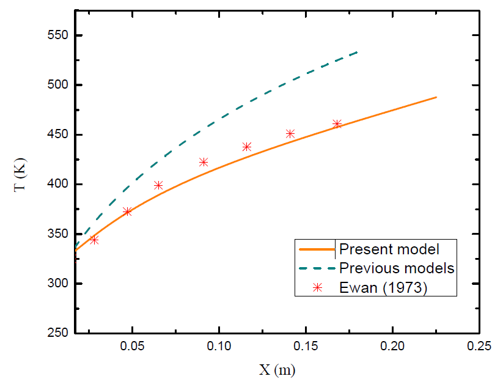
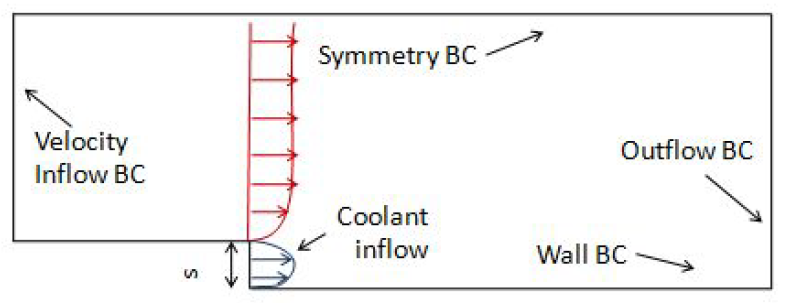

># Gaseous cooling using 1D analytical model 

A superior 1-D analytical model in MATLAB for  gaseous film cooling applicable to rocket nozzles has been developed, which takes into account
1) the effect of mixing,
2) coolant injection on the velocity profile,
3) radiation 
4) and freestream turbulence.

This repository contains MATLAB script tuned for gaseous cooling for 1D flat plate and in progress for extending for a specific genric rocket nozzle.

>**Reuslts:**

Comparision of 1D analytical model to experimnet found in literature.

>**Ongoing work:**
Fluent simulation to validate the current 1d analytical model

>**Results coming soon:**

